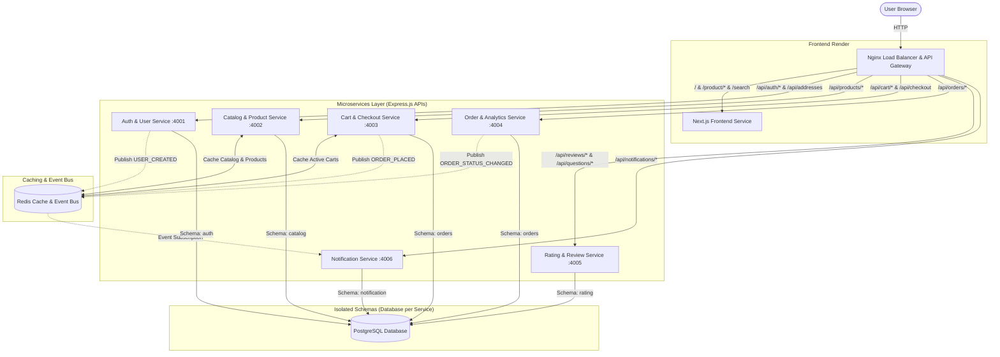

# FlipAmaz - Distributed E-Commerce Microservices Platform 🚀

**FlipAmaz** is a high-performance, highly scalable e-commerce platform that combines the best features of Flipkart and Amazon. It is built from the ground up using a containerized **microservices architecture** that replaces monolithic resource contention with isolated database schemas, high-speed Redis caching, and asynchronous event-driven background processing.

---

## 🏗 System Architecture Diagram

Client requests are intercepted by Nginx, which serves as a centralized API Gateway and Load Balancer, routing traffic to either the Next.js frontend pages or the individual microservice endpoints.



---

## 🛠 Technology Stack

* **Frontend**: Next.js 16 (App Router) - Server-Side Rendering (SSR) optimized for speed and SEO.
* **Backend APIs**: Node.js & Express.js - Lightweight and optimized for asynchronous operations.
* **Database Layer**: PostgreSQL 16 - Multi-schema configuration implementing the *database-per-service* pattern.
* **Data Layer ORM**: Prisma Client - Type-safe queries and auto-migrations.
* **Caching & Session Storage**: Redis 7 - Active cart persistence and catalog result cache.
* **Event Broker**: Redis Pub/Sub - Event Bus facilitating asynchronous notification triggers.
* **Routing & Reverse Proxy**: Nginx (Alpine) - Central Gateway serving page loops and load balancing.
* **Containerization**: Docker & Docker Compose - Orchestrating 10 services on a shared virtual network.

---

## 📂 Project Directory Structure

```
flipamaz/
├── docker-compose.yml           # Complete container orchestrator
├── gateway/
│   └── nginx.conf               # Nginx routing configurations (Port 80)
├── frontend/                    # Pure Next.js React frontend (No direct DB imports)
│   ├── src/
│   │   ├── app/                 # SSR layouts and search/product detail routes
│   │   └── components/          # Reusable components (Header with notification dropdown, Carousel)
│   └── Dockerfile               # Build configuration for Next.js app
└── services/
    ├── init.sql                 # Database script initialization
    ├── auth-service/            # Port 4001: JWT cookie sessions & user profiles
    ├── catalog-service/         # Port 4002: Cache-Aside product directory
    ├── cart-service/            # Port 4003: Redis cart sync & inventory checker
    ├── order-service/           # Port 4004: Orders list and admin analytics
    ├── rating-service/          # Port 4005: Customer reviews & product Q&As
    └── notification-service/    # Port 4006: Background PubSub worker for user alerts
```

---

## 💎 Features

1. **API Gateway & Routing Layer**: Nginx maps `/api/...` prefixes directly to backends, shielding backend ports from the public internet.
2. **Database Schema Isolation**: SQLite was replaced with isolated logical schemas in PostgreSQL: `auth`, `catalog`, `orders`, `rating`, and `notification`.
3. **Redis Cache-Aside Pattern**: Caches products and catalog searches inside Redis. Catalog updates automatically invalidate the cache. Active shopping carts are stored in Redis for instantaneous page feedback.
4. **Redis Pub/Sub Event Bus**: Checkout operations instantly publish an `ORDER_PLACED` event. Decoupled background workers log orders, generate invoices, and publish statuses asynchronously.
5. **Real-time Notifications Bell UI**: Dynamic bell drop-down inside the navigation header polls active alerts with glassmorphic slides, badge unread counters, and mark-all-as-read options.
6. **Automatic Self-Seeding**: Upon cluster startup, services wait for Postgres, push schema tables using Prisma, and seed initial records automatically if empty.

---

## 🚀 Setup & Startup Guide

### Prerequisites
Make sure you have **Docker Desktop** installed and running on your system.

### Steps
1. Clone the repository:
   ```bash
   git clone https://github.com/Krishnaiad/Flipamaz.git
   cd Flipamaz
   ```
2. Build and start the containerized cluster:
   ```bash
   docker compose up --build -d
   ```
3. Open your browser and go to:
   👉 **`http://localhost`** (Nginx is mapped to port `80`)

---

## 🔑 Test Credentials (Password: `password123`)

* **Customer**: `customer@flipamaz.com`
* **Admin/Seller**: `admin@flipamaz.com` (Grants access to the Admin Dashboard metrics and weekly sales charts)
* **Coupon Codes**:
  - `WELCOME10` (10% discount)
  - `FLIPAMAZ100` (Flat ₹100 discount)
